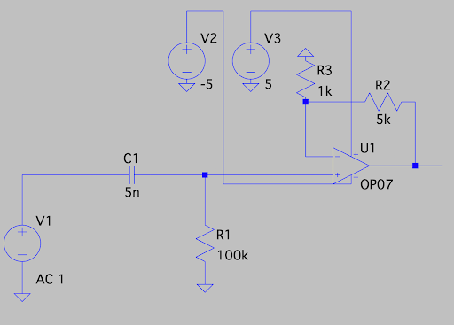
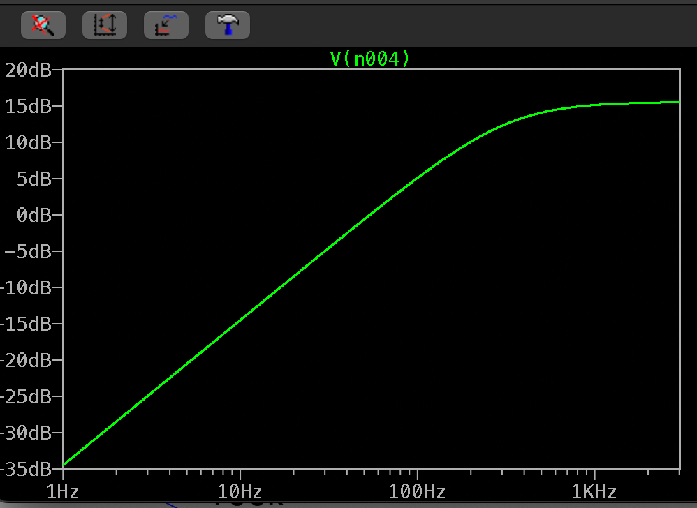
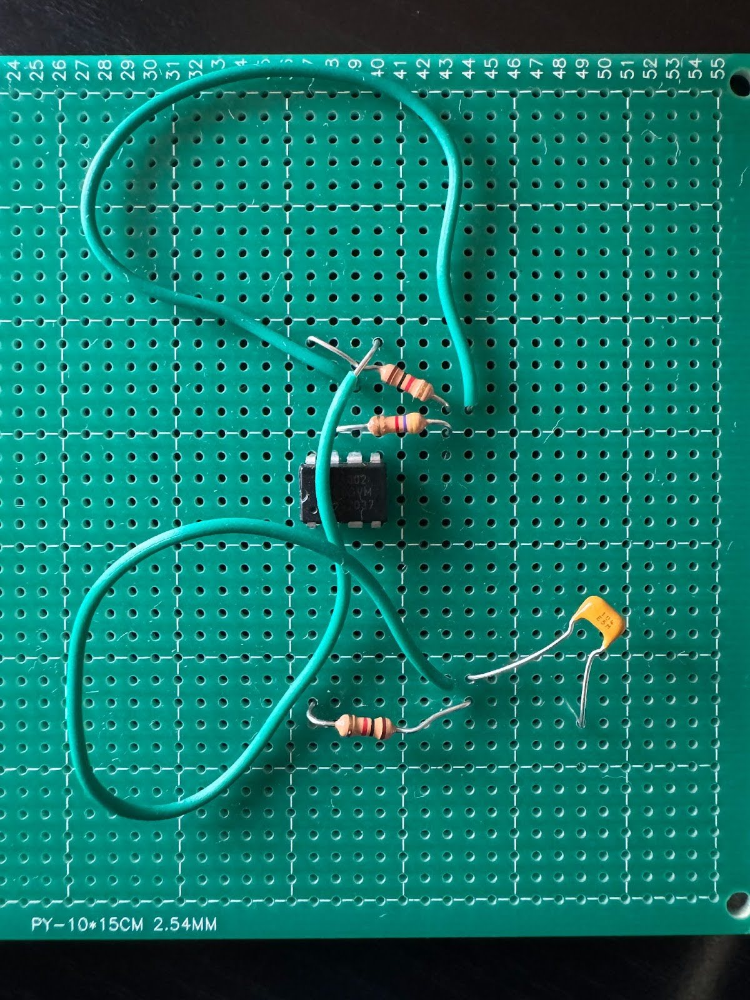
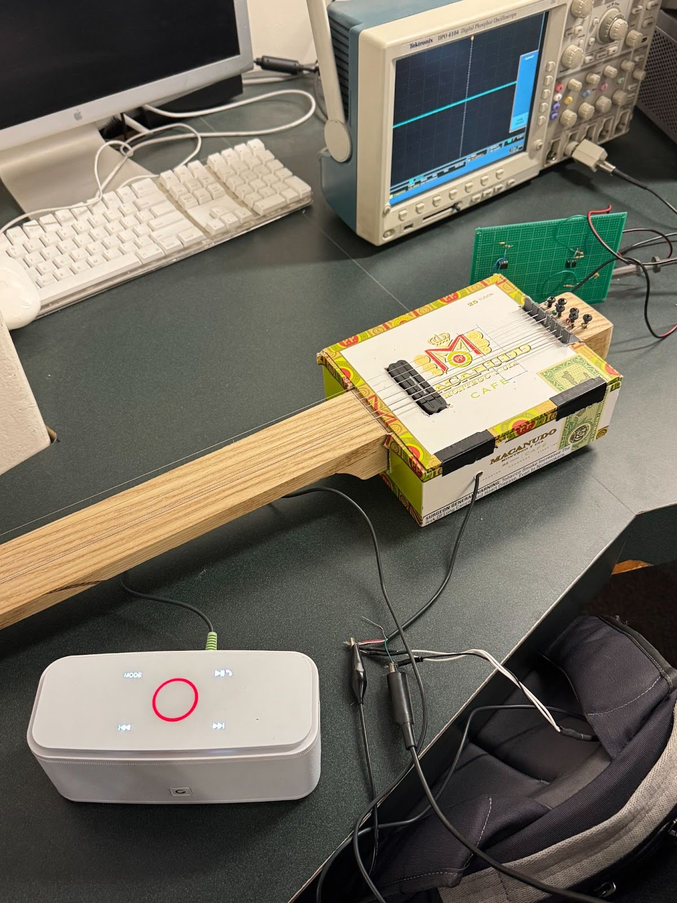

# Electric Guitar with High Pass Filter

For this project I built a cigar box electric guitar. The linear filter circuitry I decided to build was a first order high-pass buffered RC circuit. This filter will allow frequencies above 318.3 Hz to pass through, and amplify the output signal for a gain of 6.

# Circuit

A picture of the designed high-pass buffered RC circuit using LTSpice is shown below:

# Simulation

Using LTSpice I simulated the behavior of the circuit from 1Hz to 1kHz. The resulting signal graph is shown below which shows the graph beginning to reach its asymptote at around 318.3 Hz. At the same time, the output signal reaches a maximum value of 15dB due to the gain of 6 amplification.

# PCB Circuit Board

The completed soldered PCB circuit board is shown below:

# Guitar

The completed electric guitar is shown below:

